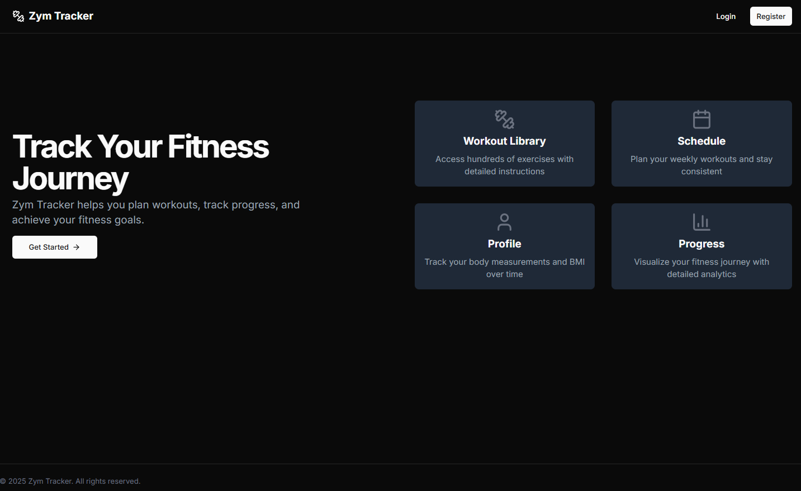
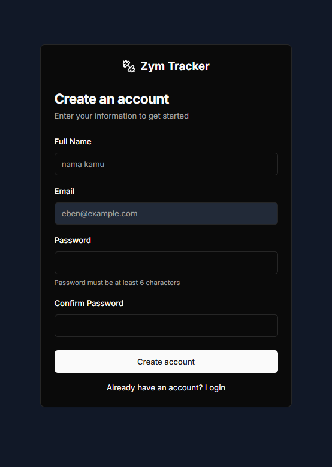
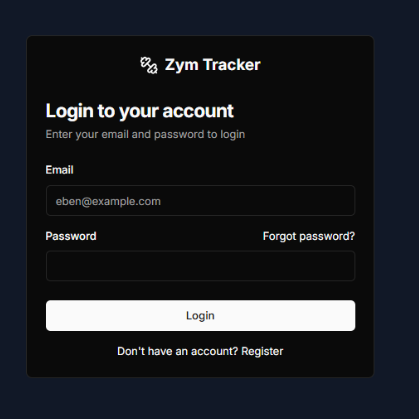
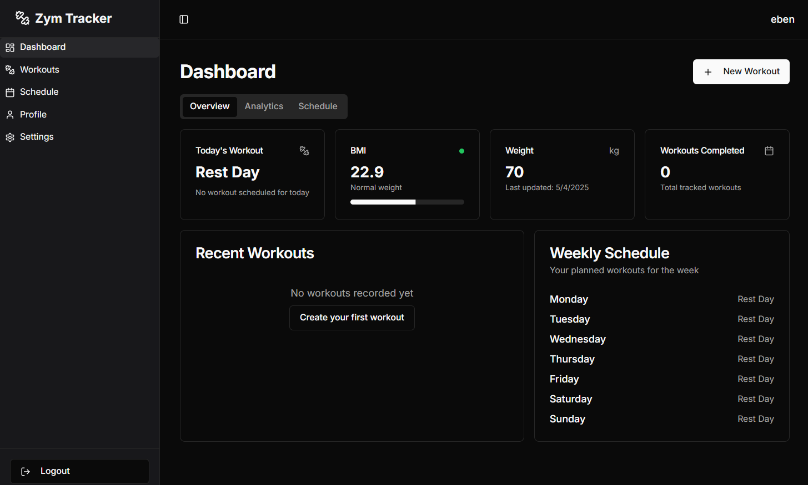
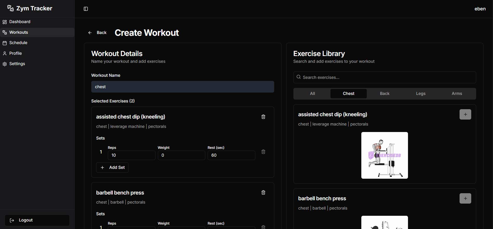
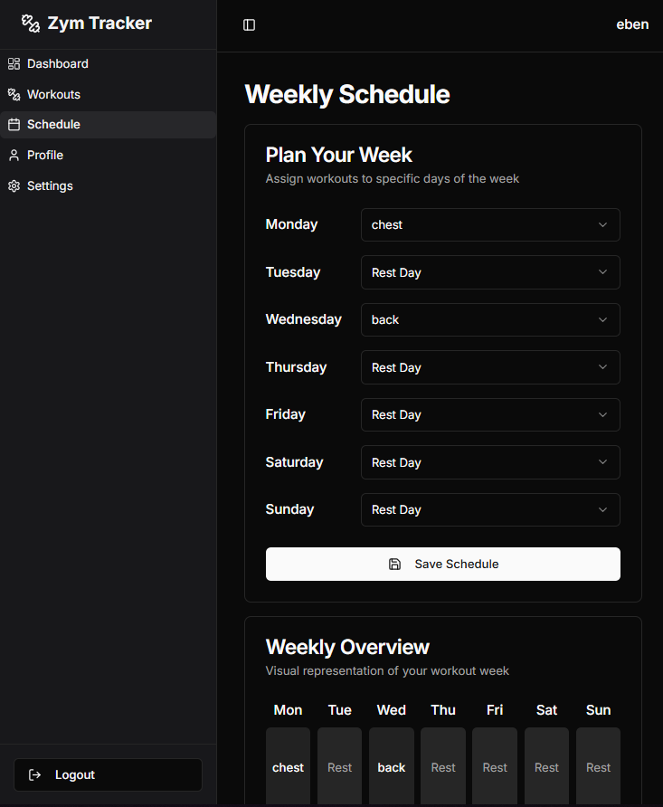
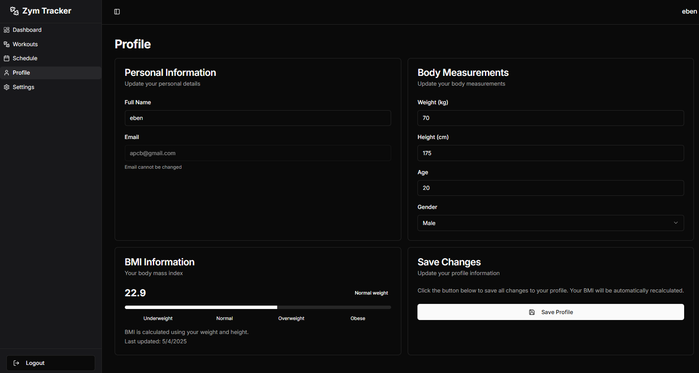
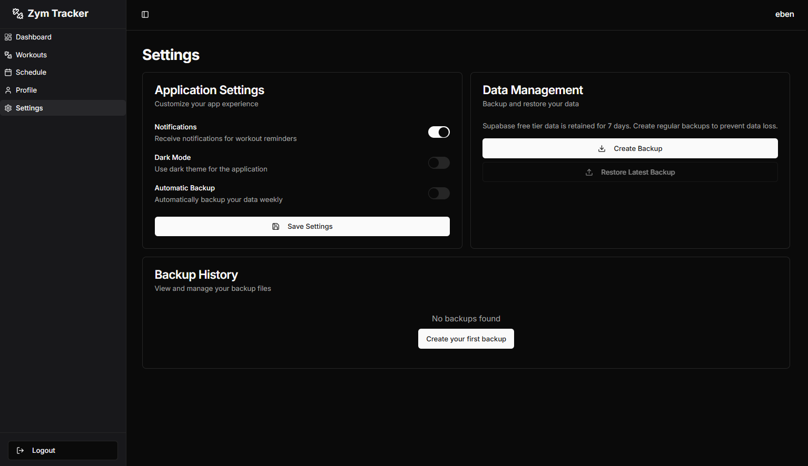
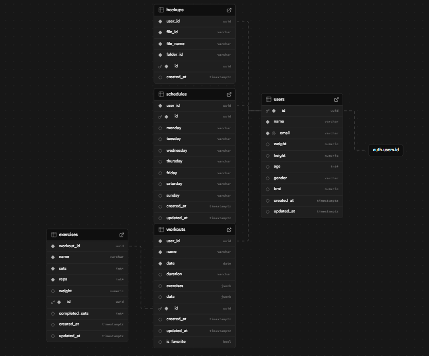

# 🏋️‍♂️ Zym Tracker


**Zym Tracker** adalah aplikasi web yang dirancang untuk membantu Anda melacak dan mengelola aktivitas olahraga. Catat setiap sesi latihan, atur jadwal mingguan, dan pantau progres Anda untuk membangun gaya hidup sehat yang konsisten.

➡️ **[Lihat Live Demo]([(https://youtu.be/ar0aAbNHun8)])**

---

## 📸 Tampilan Aplikasi

| Landing Page | Pendaftaran Akun |
| :---: | :---: |
| Halaman utama yang menyambut pengguna. | Halaman untuk membuat akun baru. |
|  |  |

| Login | Dashboard |
| :---: | :---: |
| Halaman untuk masuk ke akun terdaftar. | Ringkasan aktivitas setelah login. |
|  |  |

| Pencatatan Latihan | Jadwal Mingguan |
| :---: | :---: |
| Fitur untuk menambahkan detail sesi latihan. | Fitur untuk mengatur jadwal mingguan. |
|  |  |

| Profil Pengguna | Pengaturan |
| :---: | :---: |
| Halaman untuk melihat dan mengubah profil. | Halaman untuk menyesuaikan pengaturan. |
|  |  |


---

## 🚀 Fitur Utama

- **📝 Autentikasi Pengguna:** Sistem pendaftaran dan login yang aman menggunakan Supabase.
- **🏠 Dashboard Interaktif:** Tampilan ringkasan aktivitas latihan dan navigasi cepat.
- **💪 Pencatatan Latihan:** Catat detail setiap sesi, termasuk jenis latihan, durasi, dan intensitas.
- **📅 Jadwal Mingguan:** Rencanakan dan visualisasikan jadwal latihan Anda agar tetap teratur.
- **👤 Manajemen Profil:** Kelola data pribadi dan pantau perkembangan latihan Anda.
- **⚙️ Pengaturan Akun:** Sesuaikan preferensi dan pengaturan aplikasi sesuai kebutuhan.

---

## 🛠️ Teknologi yang Digunakan

- **Frontend:**
  - HTML, CSS, JavaScript
  - [React.js](https://reactjs.org/)
  - [Tailwind CSS](https://tailwindcss.com/)
- **Backend & Database:**
  - [Supabase](https://supabase.io/) (Autentikasi & Database)
  - Google Apps Script & Google Drive
- **API Eksternal:**
  - GYM API

---

## 🗄️ Skema Database (ERD)

Berikut adalah visualisasi skema database dan relasi antar tabel yang digunakan dalam proyek Zym Tracker.




**Penjelasan Relasi Utama:**
-   Tabel `users` terhubung langsung dengan sistem autentikasi bawaan Supabase (`auth.users`).
-   Setiap `workouts` dan `schedules` terikat pada `user_id` untuk memastikan data hanya bisa diakses oleh pemiliknya.
-   Tabel `exercises` memiliki relasi dengan tabel `workouts` untuk mencatat detail setiap sesi latihan.

---

## ⚙️ Instalasi & Konfigurasi

Untuk menjalankan proyek ini secara lokal, ikuti langkah-langkah berikut:

### 1. Prasyarat
Pastikan Anda sudah menginstal:
- [Node.js](https://nodejs.org/en/) (v16 atau lebih tinggi)
- [npm](https://www.npmjs.com/) atau [yarn](https://yarnpkg.com/)

### 2. Clone Repositori
```bash
git clone [https://github.com/hnxzl/zym-tracker.git](https://github.com/hnxzl/zym-tracker.git)
```

### 3. Masuk ke Direktori Proyek
```bash
cd zym-tracker
```

### 4. Instal Dependensi
```bash
npm install
# atau
yarn install
```

### 5. Jalankan Aplikasi
```bash
npm start
# atau
yarn start
```
Aplikasi akan berjalan di `http://localhost:3000`.

---

## 🤝 Kontribusi

Kontribusi sangat kami harapkan! Jika Anda ingin berkontribusi, silakan lakukan *Fork* pada repositori ini dan buat *Pull Request* dengan perubahan yang Anda usulkan.

1.  Fork repositori ini.
2.  Buat branch fitur baru (`git checkout -b fitur/NamaFiturBaru`).
3.  Commit perubahan Anda (`git commit -m 'Menambahkan fitur baru'`).
4.  Push ke branch Anda (`git push origin fitur/NamaFiturBaru`).
5.  Buka *Pull Request*.

---
